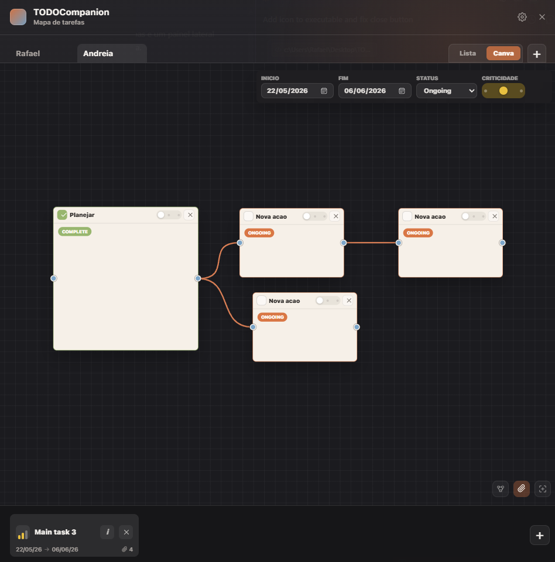
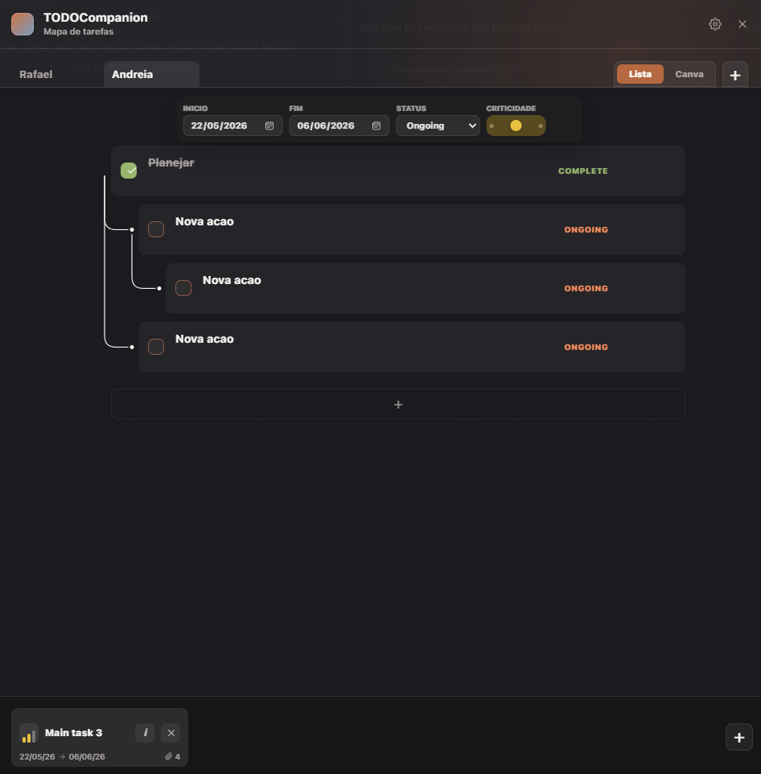

<div align="center">

# TODOCompanion

**Um companion de tarefas leve, sempre por perto, construído com Tauri.**

Mapas de ações, vínculos visuais entre etapas e um painel lateral que se acopla à sua tela.

---

## Visão geral

TODOCompanion é um app desktop minimalista para organizar tarefas em dois modos complementares:

- **Canva** — espaço livre onde cada ação é um card arrastável, com ligações que mostram dependências entre etapas.
- **Lista** — visão hierárquica das mesmas ações, com indentação e conectores que refletem o fluxo do canva.

A janela vive recolhida na borda da tela e se expande quando você precisa dela.

<div align="center">




<br /><br />



</div>

## Recursos

- Abas por usuário com renomeação inline
- Múltiplas main tasks por usuário, reorganizáveis no dock inferior
- Status, prioridade e criticidade visuais
- Conexões entre cards com lineage highlight no hover
- Datas de início/fim e barra de metadados centralizada
- Anexos por main task
- Persistência local via SQLite (Tauri) com fallback em `localStorage`

## Stack

- **[Tauri 2](https://tauri.app/)** — shell desktop nativo
- **Rust** — backend e persistência
- **HTML + CSS + JS (módulos ES, sem framework)** — frontend

## Rodando localmente

Pré-requisitos: [Node.js](https://nodejs.org/) e [Rust](https://www.rust-lang.org/tools/install) instalados.

```bash
# instalar dependências
npm install

# rodar em modo dev
npm run dev

# gerar binário
npm run build
```

## Estrutura

```
src/              Frontend (HTML, CSS, JS)
src-tauri/        Backend Rust + configuração Tauri
assets/           Recursos estáticos
scripts/          Scripts auxiliares
```

## Status

Projeto pessoal em desenvolvimento ativo. Funcionalidades e visual ainda evoluem rapidamente.

## Licença

Uso pessoal. Sem licença pública definida no momento.
